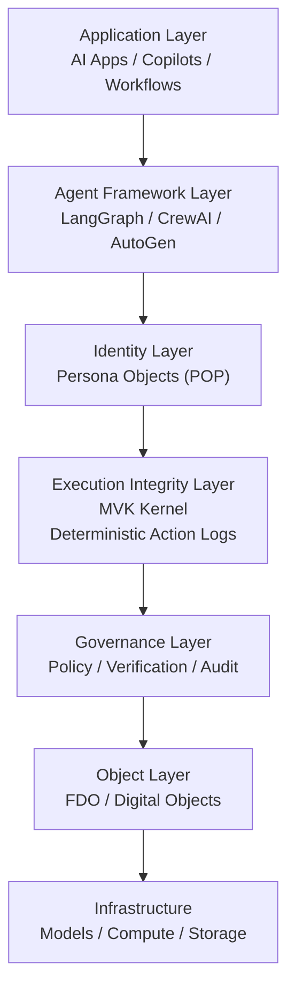

<!-- language-switch:start -->
[English](./README.md) | [中文](./README.zh-CN.md)
<!-- language-switch:end -->

# fdo-kernel-mvk

Execution-integrity layer for deterministic, replay-verifiable AI runtime proof
surfaces.

fdo-kernel-mvk is the execution-integrity layer repository in the Digital
Biosphere Architecture. It focuses on deterministic execution, replay
validation, and runtime truth surfaces. It is a layer repo, not the whole
stack.

## Role

`fdo-kernel-mvk` is the execution-integrity layer repository in the Digital
Biosphere Architecture.

It focuses on deterministic execution, replay validation, and runtime truth
surfaces.

It is a layer repo, not the whole stack.

## Not this repo

- not the governance runtime
- not the audit control plane
- not the architecture hub
- not the evidence packaging toolkit
- not the benchmark suite

## Start here

- [docs/walkthrough.md](docs/walkthrough.md)
- [digital-biosphere-architecture](https://github.com/joy7758/digital-biosphere-architecture)
- [token-governor](https://github.com/joy7758/token-governor)
- [agent-evidence](https://github.com/joy7758/agent-evidence)
- [aro-audit](https://github.com/joy7758/aro-audit)

## Architecture navigation

- system context -> [digital-biosphere-architecture](https://github.com/joy7758/digital-biosphere-architecture)
- governance layer -> [token-governor](https://github.com/joy7758/token-governor)
- concrete evidence packaging entry -> [agent-evidence](https://github.com/joy7758/agent-evidence)
- post-execution review -> [aro-audit](https://github.com/joy7758/aro-audit)
- shortest walkthrough -> [verifiable-agent-demo](https://github.com/joy7758/verifiable-agent-demo)

## Commands

- `make run` -> `EXECUTION_OK`
- `make replay` -> `REPLAY_PASS`
- `make tamper` -> `CONFORMANCE_FAIL`

## Architecture Context

This repository is part of the [Digital Biosphere Architecture](https://github.com/joy7758/digital-biosphere-architecture) ecosystem.
It contributes the Execution Integrity Layer rather than trying to be the whole stack.
Its focus is execution truth, verification surface, and runtime integrity.

What it proves:
- Deterministic state evolution
- Canonical object checksum verification
- Trace-bound replay validation

Security note:
- This prototype currently uses SHA-256 checksums for tamper detection.
- Checksums provide integrity checks, not identity-bound digital signatures.

## AI Agent Stack Architecture

This repository also explores where execution integrity fits in the broader AI agent stack.

See:
- [AI Agent Architecture Map](docs/architecture/agent-architecture-map.md)
- [AI Agent Runtime & Security Stack](docs/architecture/agent-runtime-stack.md)
- [AI Agent Stack Architecture](docs/architecture/ai-agent-stack-architecture.md)
- [AI Agent Security Architecture](docs/architecture/ai-agent-security-architecture.md)
- [AI Agent Runtime OSI Model](docs/architecture/agent-runtime-osi.md)

Core layers:
- Application
- Agent Framework
- Identity
- Execution Integrity
- Governance
- Object Layer
- Infrastructure

Key distinction:
- Governance decides what should be allowed.
- Execution integrity proves what actually happened.

## License

MIT

## Schema Notes

- [Evidence → Inference → Action](docs/schema-notes/evidence-inference-action.md)

## Architecture Notes

- [Execution Integrity vs Governance Runtime](docs/architecture/execution-integrity-vs-governance-runtime.md)

## Roadmap Notes

- [Success-Side Execution Traces](docs/roadmap-notes/success-side-execution-traces.md)
