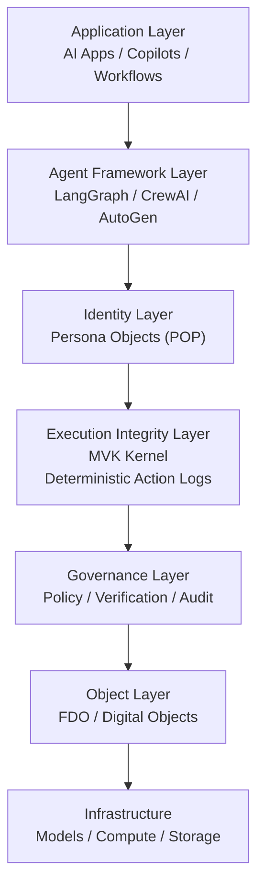

fdo-kernel-mvk

Minimal Deterministic Execution Kernel (Prototype)

An exploration of execution integrity as a first-class layer in the AI agent stack.

## Architecture Context

This repository is part of the [Digital Biosphere Architecture](https://github.com/joy7758/digital-biosphere-architecture) ecosystem.
It contributes the Execution Integrity Layer rather than trying to be the whole stack.
Its focus is execution truth, verification surface, and runtime integrity.

Commands:
- make run    -> EXECUTION_OK
- make replay -> REPLAY_PASS
- make tamper -> CONFORMANCE_FAIL (fail-closed)

What it proves:
- Deterministic state evolution
- Canonical object signature verification
- Trace-bound replay validation

## AI Agent Stack Architecture

This repository also explores where execution integrity fits in the broader AI agent stack.

See:
- [AI Agent Architecture Map](docs/architecture/agent-architecture-map.md)
- [AI Agent Runtime & Security Stack](docs/architecture/agent-runtime-stack.md)
- [AI Agent Stack Architecture](docs/architecture/ai-agent-stack-architecture.md)
- [AI Agent Security Architecture](docs/architecture/ai-agent-security-architecture.md)
- [AI Agent Runtime OSI Model](docs/architecture/agent-runtime-osi.md)

Core layers:
- Application
- Agent Framework
- Identity
- Execution Integrity
- Governance
- Object Layer
- Infrastructure

Key distinction:
- Governance decides what should be allowed.
- Execution integrity proves what actually happened.
