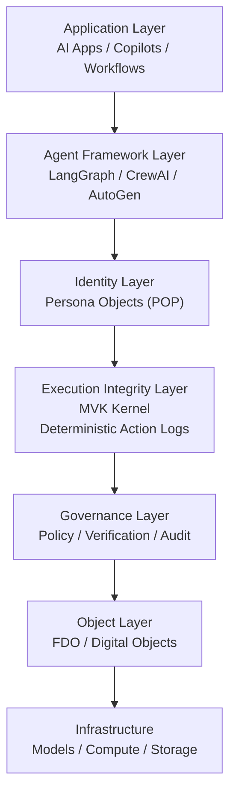

<!-- language-switch:start -->
[English](./README.md) | [中文](./README.zh-CN.md)
<!-- language-switch:end -->

fdo 内核 mvk

最小确定性执行内核（原型）

对作为 AI 代理堆栈中的一流层的执行完整性的探索。

## 架构背景

该仓库是[数字生物圈架构](https://github.com/joy7758/digital-biosphere-architecture)生态系统的一部分。
它贡献了执行完整性层，而不是试图成为整个堆栈。
它的重点是执行真相、验证表面和运行时完整性。

命令：
- 运行 -> EXECUTION_OK
- 重播 -> REPLAY_PASS
- make tamper -> CONFORMANCE_FAIL（失败关闭）

它证明了什么：
- 确定性状态演化
- 规范对象校验和验证
- 跟踪绑定重放验证

安全说明：
- 该原型当前使用 SHA-256 校验和进行篡改检测。
- 校验和提供完整性检查，而不是身份绑定的数字签名。

## AI 智能体堆栈架构

该仓库还探讨了执行完整性在更广泛的AI 智能体堆栈中的适用范围。

看：
- [AI 智能体架构图](docs/architecture/agent-architecture-map.md)
- [AI智能体运行时和安全堆栈](docs/architecture/agent-runtime-stack.md)
- [AI 智能体堆栈架构](docs/architecture/ai-agent-stack-architecture.md)
- [AI 智能体安全架构](docs/architecture/ai-agent-security-architecture.md)
- [AI 智能体运行时OSI模型](docs/architecture/agent-runtime-osi.md)

核心层：
- 应用
- 代理框架
- 身份
- 执行完整性
- 治理
- 对象层
- 基础设施

主要区别：
- 治理决定应该允许什么。
- 执行完整性证明了实际发生的情况。

## 执照

麻省理工学院

## 架构注释

- [证据→推论→行动](docs/schema-notes/evidence-inference-action.md)

## 架构笔记

- [执行完整性与治理运行时](docs/architecture/execution-integrity-vs-governance-runtime.md)

## 路线图注释

- [成功端执行跟踪](docs/roadmap-notes/success-side-execution-traces.md)
