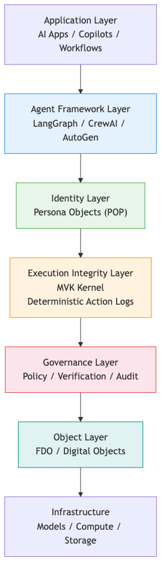

# AI Agent Architecture Map

This diagram summarizes the emerging architecture of AI agent systems as a single layered map.

It integrates the concepts explored across this repository:

- Agent Runtime
- Persona Object Protocol (POP)
- Minimum Verifiable Kernel (MVK)
- Execution Integrity
- FDO / Digital Objects

## Diagram

## Layered View

### Application Layer

The user-facing system that wants an outcome.

Examples:

- AI apps
- Copilots
- Workflows

### Agent Framework Layer

The orchestration layer for planning, tool use, and multi-agent coordination.

Examples:

- LangGraph
- CrewAI
- AutoGen

### Identity Layer

The stable operating profile of the agent.

This repository maps that concern to `Persona Objects (POP)`.

### Governance Layer

The policy and verification layer that decides what should be allowed before execution proceeds.

Examples:

- Policy
- Verification
- Audit preparation

### Execution Integrity Layer

The execution substrate that records what actually happened and makes runtime behavior verifiable.

This repository maps that concern to:

- MVK kernel
- Deterministic action logs

### Object Layer

The durable object model used to represent state, outputs, or interoperable artifacts.

This repository maps that concern to:

- FDO
- Digital Objects

### Infrastructure

The substrate the full system runs on.

Examples:

- Models
- Compute
- Storage

## Key Idea

Most public discussion still centers on prompts or orchestration frameworks.

In production systems, that is incomplete.

Identity, governance, execution integrity, and durable objects all matter if the goal is a system that can be operated, verified, and referenced over time.

In this framing, execution integrity acts as the bridge between agent reasoning and real-world actions, while the object layer provides stable artifacts that outlive a single run.

## Related Materials

- Mermaid source: `docs/assets/agent-architecture-map.mmd`
- OSI-style framing: `docs/architecture/agent-runtime-osi.md`
- Simplified runtime stack: `docs/architecture/agent-runtime-stack.md`
- Security-oriented framing: `docs/architecture/ai-agent-security-architecture.md`
