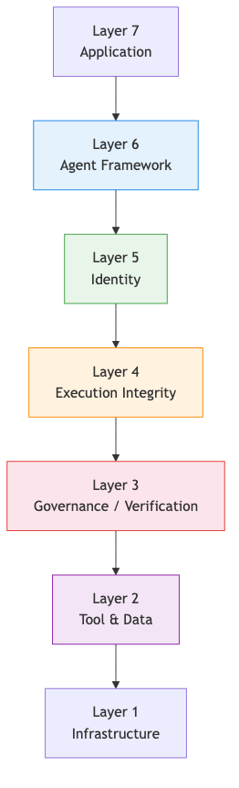

# AI Agent Runtime OSI Model

A conceptual OSI-style layered model for AI agent runtime architecture.

The purpose of this framing is to make each runtime concern explicit, especially the distinction between execution integrity, governance, and the tool or data plane beneath them.

## Layers

### Layer 7. Application

The user-facing system or workflow that wants a result.

Examples:

- Apps
- Workflows
- Copilots

### Layer 6. Agent Framework

The orchestration layer for planning, memory, tool routing, and multi-agent behavior.

Examples:

- LangGraph
- CrewAI
- AutoGen

### Layer 5. Identity Layer

The stable operating profile of the agent across runs.

This includes:

- Persona
- Roles
- Capabilities

### Layer 4. Governance / Verification

The control layer that applies policy and validates whether execution stayed within allowed boundaries.

Examples:

- Policy validation
- Security checks
- Auditability

### Layer 3. Execution Integrity

The evidence layer that records and verifies what the runtime actually did.

Examples:

- Deterministic action traces
- Replayable runtime logs

### Layer 2. Tool & Data

The systems the agent interacts with during execution.

Examples:

- APIs
- Databases
- Services

### Layer 1. Infrastructure

The substrate that powers the runtime.

Examples:

- Models
- Compute
- Storage

## Diagram

## Why this framing helps

An OSI-style stack makes it easier to discuss where a given mechanism belongs.

- Application explains the user-facing outcome.
- Framework explains orchestration.
- Identity explains who the agent is allowed to be.
- Governance explains what policies apply.
- Execution integrity explains what can be proven later.
- Tool and data explains what the agent can reach.
- Infrastructure explains what the whole system runs on.

This is still a conceptual model rather than a formal standard, but it gives a clearer vocabulary for discussing agent runtime architecture.

## Related Materials

- Mermaid source: `docs/assets/agent-runtime-osi.mmd`
- Simplified runtime stack: `docs/architecture/agent-runtime-stack.md`
- Security-oriented framing: `docs/architecture/ai-agent-security-architecture.md`
