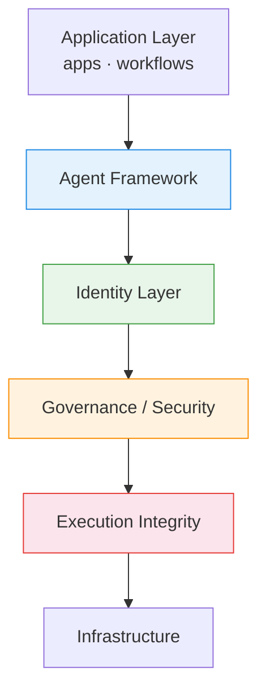

# AI Agent Runtime & Security Stack

A simplified view of the emerging AI agent runtime architecture.

Layers:

1. Application
2. Agent Framework
3. Identity Layer
4. Governance / Security
5. Execution Integrity
6. Infrastructure

## Why Execution Integrity

Many discussions focus on orchestration or prompt guardrails.

In practice, once agents interact with tools and APIs, failures often come from action execution, not just text generation.

Execution integrity focuses on:

- deterministic action traces
- causal chain reconstruction
- replayable runtime logs
- auditability of agent decisions

## Diagram

This is still an early conceptual sketch intended to clarify discussion around agent runtime architecture.

Canonical five-layer order:

Persona -> Interaction -> Governance -> Execution Integrity -> Audit

## Related Materials

- Mermaid source: `docs/assets/agent-runtime-stack.mmd`
- Broader stack framing: `docs/architecture/ai-agent-stack-architecture.md`
