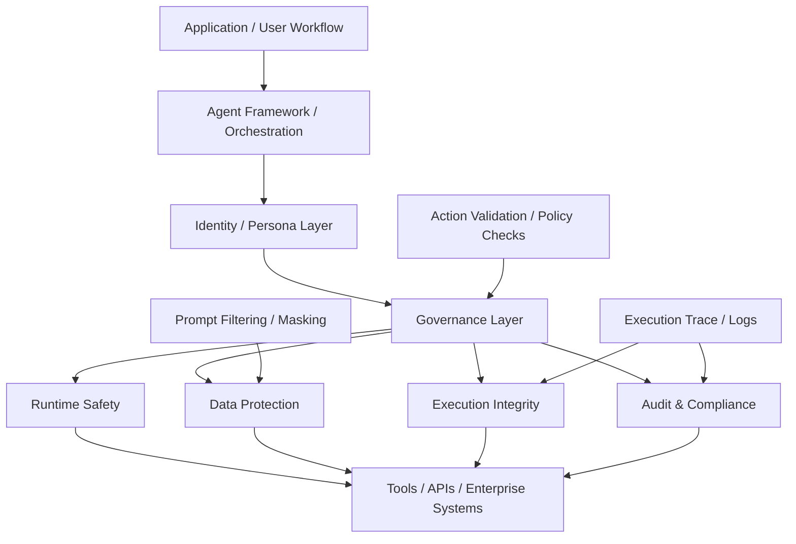

# AI Agent Security Architecture

This document sketches a practical security architecture for AI agent systems.

It is framework-agnostic and intended to clarify how security, governance, and verification concerns relate to one another in production agent deployments.

For a simpler discussion-oriented framing, see `AI Agent Stack Architecture` in `docs/architecture/ai-agent-stack-architecture.md`.

## Why this matters

As agent systems move from experiments into enterprise workflows, security cannot be reduced to prompt guardrails alone.

Production systems usually need multiple layers:

- Runtime Safety: prevent unsafe tool execution or high-risk actions
- Data Protection: masking, redaction, retrieval boundaries, and access policies
- Execution Integrity: verify what the agent actually did
- Auditability: preserve structured logs and traces for compliance and review
- Governance: apply policy, validation, and decision gates around agent actions

## Layered View

## Interpretation

### 1. Agent Framework / Orchestration

This is where task planning, tool selection, memory usage, and multi-agent coordination usually live.

Examples include LangChain, LangGraph, CrewAI, AutoGen, and similar frameworks.

### 2. Identity / Persona Layer

This layer defines who the agent is supposed to be across runtimes:

- Role
- Behavioral constraints
- Capabilities
- Stable persona or operating profile

This is often mixed into prompts today, but it can also be represented as a structured object.

### 3. Governance Layer

This layer wraps the runtime with policy and control logic:

- Validation before action execution
- Approval or review gates
- Environment-specific rules
- Policy-aware routing

### 4. Runtime Safety

This concerns whether the agent is allowed to perform a particular operation at all.

Examples:

- Block dangerous commands
- Restrict tool access
- Enforce allowlists
- Sandbox generated code

### 5. Data Protection

This concerns whether sensitive data should be sent to the model or external systems.

Examples:

- Prompt filtering
- PHI or PII masking
- Least-privilege retrieval
- Source restrictions

### 6. Execution Integrity

This concerns whether the system can later verify what the agent actually did.

Examples:

- Structured execution traces
- Signed action logs
- Replayable step history
- Trace verification

This repository focuses most directly on this layer through deterministic state evolution, signature verification, and replay-bound validation.

### 7. Audit & Compliance

This layer supports enterprise review and regulated environments.

Examples:

- Compliance logs
- Evidence retention
- Reviewer visibility
- Incident investigation

## Practical Takeaway

In production, the agent framework is usually only one layer of the system.

The full deployment often looks like:

1. Application workflow
2. Agent orchestration
3. Governance controls
4. Safety and data protection
5. Execution trace and audit

This matters especially in healthcare, finance, legal, and enterprise automation scenarios where organizations need both policy enforcement and verifiable evidence of execution.

## Related Asset

The reusable Mermaid source for this diagram lives in `docs/assets/ai-agent-security-architecture.mmd`.
