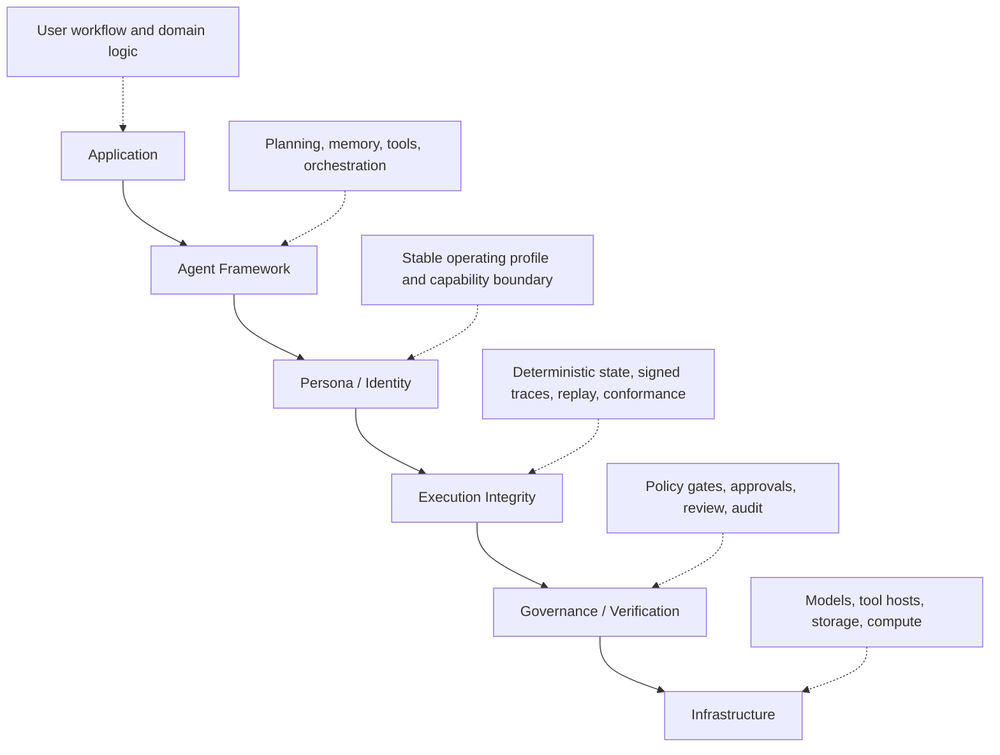

# AI Agent Stack Architecture

This document presents a discussion-oriented framing for AI agent systems.

The goal is simple: make `execution integrity` visible as a first-class layer in the stack rather than burying it inside generic orchestration, observability, or governance language.

## Layered View

## What Each Layer Means

### 1. Application

The business or user-facing system that wants an outcome.

Examples:

- Customer support workflow
- Research copilot
- Healthcare intake assistant
- Internal enterprise automation

### 2. Agent Framework

The orchestration layer where most current discussion happens.

Examples:

- Planning
- Memory
- Tool routing
- Multi-agent coordination

Frameworks like LangChain, LangGraph, CrewAI, and AutoGen usually live here.

### 3. Persona / Identity

The stable operating profile of the agent.

This includes:

- Role and responsibility
- Capability boundary
- Behavioral constraints
- Long-lived identity across runs

This layer is often collapsed into prompts today, but it is more useful to treat it as structured system state.

### 4. Execution Integrity

This layer answers the question:

`What actually happened during execution, and can we prove it later?`

Examples:

- Deterministic state transitions
- Signed or canonicalized action records
- Replayable step history
- Conformance checks against declared state

This repository is primarily an exploration of this layer.

### 5. Governance / Verification

This layer wraps execution with organizational control.

Examples:

- Policy gates
- Approval checkpoints
- Reviewer workflows
- Compliance evidence and audit review

It is separated here from execution integrity on purpose.

Governance decides whether actions should be allowed, escalated, or reviewed.

Verification uses evidence to evaluate whether the system stayed within policy and whether execution artifacts are trustworthy.

### 6. Infrastructure

The substrate the stack runs on.

Examples:

- Models
- Tool hosts
- Storage
- Network and compute
- Enterprise systems and APIs

## Why Separate Execution Integrity From Governance

These two concepts are often mixed together, but they solve different problems.

- Governance is normative: what should be allowed.
- Execution integrity is evidentiary: what actually happened.

You can have policy without proof.

You can also have traces without meaningful governance.

Production agent systems usually need both.

## How This Repository Maps To The Stack

`fdo-kernel-mvk` focuses on the execution-integrity layer through:

- Deterministic object identity
- Drift-bounded state evolution
- Hash-linked checkpoints
- Replay-based independent verification

The claim is not that this kernel is a full agent framework.

The claim is that agent systems need a verifiable execution substrate, and that `execution integrity` deserves to be named as a distinct layer in the stack.

## Related Assets

- Mermaid source: `docs/assets/ai-agent-stack-architecture.mmd`
- Security-oriented framing: `docs/architecture/ai-agent-security-architecture.md`
